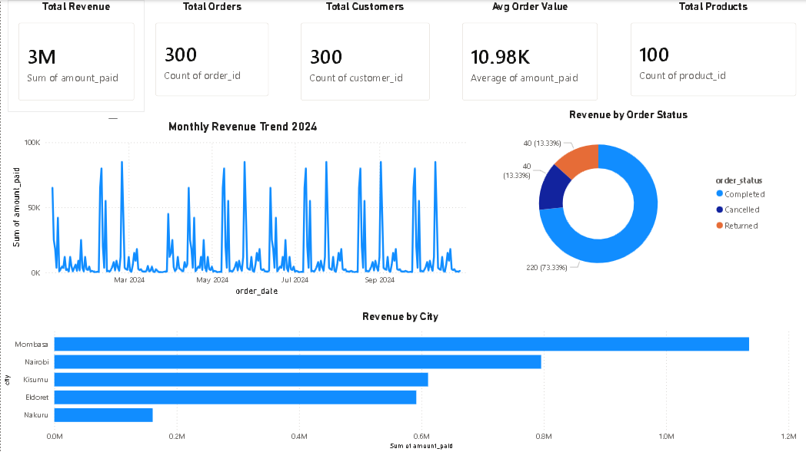

# E-comerce Sales Analysis - PostgreSQL

## Background

Driven by a quest to understand what makes an e-commerce business succeed in the Kenyan market, this project was born from a desire to uncover the real drivers of revenue, identify customer behaviour patterns and surface actionable business insights from raw transactional data.

The questions i wanted to answer through my SQL queries were:

- What drives revenue - is it order volume or order value?
- Which cities, categories and products generate the most value?
- Why are customers not coming back after their first purchase?
- Which customers are at risk of churnibg and how much revenue is at stake?
- Are there data quality issues hiding revenue leakage in the system?

SQL queries? Check them out here [ecommerce-sql folder](./ecommerce_sql)

---

## Tools i used

For my deep dive into the Kenyan e-comerce dataset i used several key tools:

- **SQL** - The backbone of my analysis, allowing me to query the database and uncover critical business insights from raw transactional data 
- **PostgreSQL** - The chosen database management system, ideal for handling relational e-commerce data across 7 interconnected tables
- **Visual Studio Code** - My go-to editor for database managemebt and executing SQL queries with the SQLTools extension
- **Git & Github** - Essential for version control and sharing my SQL scripts and analysis, ensuring project tracking and portfolio visibility
- **Power BI Desktop** - used to build an interactive 4-page business 
  dashboard visualising all key findings from the SQL analysis. 
  Includes DAX measures for calculated KPIs, cross-page slicers for 
  dynamic filtering, and relationship modelling across 7 tables.
  The dashboard covers executive summary, sales analysis, customer 
  behaviour and product performance.

---

## Database schema 

```
customers ──────< orders ──────< order_items >────── products >────── categories
                    | 
                    |──────<payments
                    |─────<shipping

```

| Table | Rows | Description |
|---|---|---|
| customers | 300 | Customer profiles — name, city, signup date |
| orders | 300 | Order headers — status, date, customer link |
| order_items | 600 | Line items — product, quantity per order |
| payments | 300 | Payment records — amount paid per order |
| products | 100 | Product catalogue — name, price, category |
| categories | 10 | Product categories |
| shipping | 300 | Shipment details — ship date, delivery date, cost |

---


## The Analysis 

Each query in this project aimed at investigating a specific aspect of the e-comerce business. Here is how i approached each question:

### 1. Revenue Drivers - What Actually Makes Money?

To identify what drives revenue i analyzed it from three angles - by city, by category and by product. The results were striking

```sql
SELECT
    categories.category_name,
    ROUND(SUM(order_items.quantity * products.price), 2)  AS total_revenue,
    ROUND(SUM(order_items.quantity * products.price) * 100.0 /
          SUM(SUM(order_items.quantity * products.price)) OVER (), 1) AS revenue_pct
FROM order_items
JOIN orders ON orders.order_id   = order_items.order_id
JOIN products ON products.product_id  = order_items.product_id
JOIN categories ON categories.category_id = products.category_id
WHERE orders.order_status = 'Completed'
GROUP BY categories.category_name
ORDER BY total_revenue DESC;
```

Here is the breakdown of revenue across categories:

- **Furniture dominates at 40.6%** of total revenue (KHS 2,554,000)
  despite having the same number of orders as most other categories
- **Electronics follows at 35%** — together these two categories
  account for 75.6% of all revenue from just 2 out of 10 categories
- **Price drives revenue more than volume** — Automotive sold the
  most units (82) but ranked only 4th in revenue

---

### 2. City Performance — Where is the Value?

```sql
SELECT
    ccustomers.city,
    ROUND(AVG(payments.amount_paid), 2)     AS avg_order_value,
    ROUND(SUM(payments.amount_paid), 2)     AS total_revenue
FROM customers 
JOIN orders ON orders.customer_id = customers.customer_id
JOIN payments ON payments.order_id    = orders.order_id
GROUP BY customers.city
ORDER BY avg_order_value DESC;
```

- **Mombasa has the highest AOV** at KHS 18,926 per order —
  7x higher than Nakuru (KES 2,679) despite equal order volumes
- All 5 cities have exactly 60 orders — proving that order VALUE
  not order VOLUME is what separates high and low revenue cities

---

### 3. Customer Retention — The Critical Problem

To understand customer loyalty I built a full RFM segmentation
model and cohort retention table:

```sql
-- RFM segmentation using NTILE()
NTILE(4) OVER (ORDER BY recency_days DESC)   AS r_score,
NTILE(4) OVER (ORDER BY frequency ASC)       AS f_score,
NTILE(4) OVER (ORDER BY monetary ASC)        AS m_score
```

- **0% customer retention** — every single customer placed exactly
  one order and never returned, representing a critical business risk
- **49.1% of customers are Champions or Loyal** by RFM score —
  a strong base that is currently being wasted with no re-engagement
- **KHS 2,592,640 in revenue at risk** from churned customers
  identified through behavioural churn signal analysis

---

### 4. Data Quality — Hidden Revenue Leakage

```sql
-- Payment vs expected product total comparison
ROUND(order_payment.actual_payment - order_product_total.expected_total, 2)  AS difference
```

- **Critical mismatch detected** — payment amounts do not match
  expected product totals across multiple completed orders
- Order 76: expected KHS 182,000 → only KHS 200 recorded (0.1% paid)
- **Duplicate customer records** — same customers registered under
  multiple IDs inflating customer count and masking true behaviour

---

## What I Learned

Throughout this project I significantly expanded my SQL toolkit:

**Advanced Query Architecture** — mastered CTEs (WITH clauses) for
building multi-step analytical pipelines, chaining up to 4 CTEs
in a single query for RFM segmentation and cohort analysis.

**Window Functions** — learned RANK(), DENSE_RANK(), ROW_NUMBER(),
NTILE(), LAG() and running SUM() — the functions that separate
junior from senior analysts in real interviews.

**Business Thinking** — developed the habit of writing findings
as comments after every query, connecting SQL output to real
business decisions rather than just displaying numbers.

**Data Quality Mindset** — built queries specifically to detect
anomalies, mismatches and duplicate records — the kind of
thinking that makes an analyst genuinely valuable to a business.

---

## Project Structure

```
ecomerce_project/
├── ecommerce_sql/
│   ├── day1_foundation.sql    ← Basic aggregations and JOINs
│   ├── day2_revenue.sql       ← Revenue and sales analysis
│   ├── day3_customers.sql     ← Customer behaviour analysis
│   ├── day4_windows.sql       ← Window functions and ranking
│   ├── day5_advanced.sql      ← CTEs, self-joins, data quality
│   └── day6_capstone.sql      ← RFM, cohort analysis, churn
├── .gitignore
└── README.md
```

---

## SQL Techniques Demonstrated

| Technique | Used in |
|---|---|
| Multi-table JOINs (3-4 tables) | Day 1-3 |
| Conditional aggregation (CASE WHEN) | Day 1-2 |
| Date functions (TO_CHAR, EXTRACT, AGE) | Day 2-3 |
| HAVING clause | Day 3 |
| Subqueries and scalar subqueries | Day 4-5 |
| Window functions (RANK, DENSE_RANK, ROW_NUMBER) | Day 4 |
| Running totals and rolling averages | Day 4 |
| PARTITION BY for group-level ranking | Day 4 |
| CTEs — single, chained and multiple | Day 4-6 |
| Self-joins for product pair analysis | Day 5 |
| CROSS JOIN for benchmark comparisons | Day 5 |
| LEFT JOIN + IS NULL pattern | Day 3, Day 5 |
| NTILE() for quartile segmentation | Day 6 |
| RFM analysis (Recency Frequency Monetary) | Day 6 |
| Cohort retention analysis | Day 6 |
| Churn signal detection | Day 6 |
| Data quality anomaly detection | Day 5 |

---

## Conclusions

### Insights

**Revenue is concentrated not distributed** — two categories
(Furniture and Electronics) generate 75.6% of all revenue.
The business should double down on these while reconsidering
the value of Food and Books which contribute less than 1% combined.

**Mombasa is the highest value market** — despite equal order
volumes across all cities, Mombasa customers spend 7x more per
order than Nakuru customers. City-specific marketing strategies
would unlock significant revenue potential.

**Customer retention is the biggest business risk** — a 0%
retention rate means every sale requires acquiring a brand new
customer. Implementing even a basic loyalty programme could
transform the business economics entirely.

**Data quality issues are hiding the true picture** — payment
mismatches and duplicate customer records mean the business
cannot accurately measure its own performance without fixing
its data infrastructure first.

### Closing Thoughts

This project enhanced my SQL skills significantly and provided
deep insights into how data analysis drives real business decisions.
The findings serve as a practical guide for any e-commerce business
operating in the Kenyan market, from understanding which products
to prioritise to identifying which customers to fight to keep.

Aspiring data analysts can learn from this project that the most
valuable skill is not writing complex queries, it is asking the
right business questions and letting the data tell its story.

---

## Dashboard Preview



| File | Description |
|---|---|
| [ecommerce_dashboard.pbix](ecommerce_dashboard.pbix) | Power BI Desktop file |
| [ecommerce_dashboard.pdf](ecommerce_dashboard.pdf) | PDF export of all 4 pages |


---

*Built with PostgreSQL • Analysed with SQL • Hosted on GitHub • Visualization  Powe BI*

**Godwin Atsali**